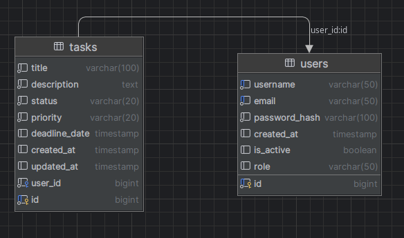

# Task Manager - система управления задачами
## Описание проекта
Task Manager - это веб-приложение для организации/
и отслеживания задач с функционалом аутентификации
пользователей. Проект разработан на Java с использованием
Hibernate ORM и PostgreSQL в качестве базы данных.

## Основные возможности
✅ Регистрация и аутентификация пользователей(а также их дальнейшая авторизация)\
✅ Создание, редактирование и удаление задач\
✅ Установка сроков выполнения (дедлайнов)\
✅ Отслеживание статусов задач (Новая, В работе, Завершена, Архив)\
✅ Фильтрация и сортировка задач

## Технологический стек
### Backend
- Java 17
- Hibernate (ORM)
- PostgreSQL (реляционная БД)
- Servlet API(веб-слой)
- BCrypt (хеширование паролей)
- Querydsl (фреймворк, который упрощает процесс написания типобезопасных запросов )

### Frontend
- JSP (шаблонизация)
- HTML/CSS/JS (базовый интерфейс)

### Инструменты
- Maven (сборка)
- Git (контроль версий)
- Tomcat (контейнер сервлетов)

## Структура базы данных


```sql
CREATE TABLE users (
    id BIGSERIAL PRIMARY KEY,
    username VARCHAR(50) UNIQUE NOT NULL,
    email VARCHAR(100) UNIQUE NOT NULL,
    password_hash VARCHAR(100) NOT NULL,
    created_at TIMESTAMP DEFAULT CURRENT_TIMESTAMP,
    is_active BOOLEAN DEFAULT TRUE,
    role VARCHAR(50) NOT NULL CHECK ( role IN ('USER','ADMIN'))
);
```

```sql
CREATE TABLE tasks (
    id BIGSERIAL PRIMARY KEY,
    title VARCHAR(100) NOT NULL,
    description TEXT,
    status VARCHAR(20) NOT NULL CHECK (status IN ('NEW', 'IN_PROGRESS', 'COMPLETED', 'ARCHIVED')),
    priority VARCHAR(20) NOT NULL CHECK (priority IN ('LOW', 'MEDIUM', 'HIGH', 'CRITICAL')),
    due_date TIMESTAMP,
    created_at TIMESTAMP DEFAULT CURRENT_TIMESTAMP,
    updated_at TIMESTAMP DEFAULT CURRENT_TIMESTAMP,
    user_id INTEGER NOT NULL REFERENCES users(id) ON DELETE CASCADE
);
```

## Сборка проекта
```
mvn clean packge
```

## Использование
1. Открыть браузер по ссылке http://localhost:8080/TaskManager/login
2. Зарегистрируйте нового пользователя или войдите под существующим
3. Создавайте задачи, устанавливайте приоритеты и сроки выполнения
4. Отслеживайте прогресс выполнения задач

## pom.xml
```xml
<project xmlns="http://maven.apache.org/POM/4.0.0" xmlns:xsi="http://www.w3.org/2001/XMLSchema-instance"
  xsi:schemaLocation="http://maven.apache.org/POM/4.0.0 http://maven.apache.org/maven-v4_0_0.xsd">
  <modelVersion>4.0.0</modelVersion>
  <groupId>by.kostya</groupId>
  <artifactId>TaskManagerApplication</artifactId>
  <packaging>war</packaging>
  <version>1.0-SNAPSHOT</version>
  <name>TaskManagerApplication Maven Webapp</name>
  <url>http://maven.apache.org</url>
  <dependencies>
    <dependency>
      <groupId>junit</groupId>
      <artifactId>junit</artifactId>
      <version>3.8.1</version>
      <scope>test</scope>
    </dependency>
    <dependency>
      <groupId>org.junit.jupiter</groupId>
      <artifactId>junit-jupiter-api</artifactId>
      <version>5.13.0-M3</version>
      <scope>test</scope>
    </dependency>
    <dependency>
      <groupId>org.postgresql</groupId>
      <artifactId>postgresql</artifactId>
      <version>42.7.5</version>
    </dependency>
    <dependency>
      <groupId>org.hibernate.orm</groupId>
      <artifactId>hibernate-core</artifactId>
      <version>6.6.13.Final</version>
    </dependency>
    <dependency>
      <groupId>jakarta.servlet</groupId>
      <artifactId>jakarta.servlet-api</artifactId>
      <version>6.1.0</version>
      <scope>provided</scope>
    </dependency>
    <dependency>
      <groupId>jakarta.servlet.jsp.jstl</groupId>
      <artifactId>jakarta.servlet.jsp.jstl-api</artifactId>
      <version>3.0.2</version>
    </dependency>
    <dependency>
      <groupId>org.glassfish.web</groupId>
      <artifactId>jakarta.servlet.jsp.jstl</artifactId>
      <version>3.0.1</version>
    </dependency>
    <dependency>
      <groupId>org.projectlombok</groupId>
      <artifactId>lombok</artifactId>
      <version>1.18.38</version>
      <scope>provided</scope>
    </dependency>
    <dependency>
      <groupId>org.mindrot</groupId>
      <artifactId>jbcrypt</artifactId>
      <version>0.4</version>
    </dependency>

    <dependency>
      <groupId>org.hibernate.validator</groupId>
      <artifactId>hibernate-validator</artifactId>
      <version>8.0.2.Final</version>
    </dependency>
    <dependency>
      <groupId>jakarta.el</groupId>
      <artifactId>jakarta.el-api</artifactId>
      <version>6.0.1</version>
    </dependency>
    <dependency>
      <groupId>com.querydsl</groupId>
      <artifactId>querydsl-apt</artifactId>
      <version>5.1.0</version>
      <scope>provided</scope>
      <classifier>jakarta</classifier> <!-- Важно! -->
    </dependency>
    <dependency>
      <groupId>com.querydsl</groupId>
      <artifactId>querydsl-jpa</artifactId>
      <version>5.1.0</version>
      <classifier>jakarta</classifier>
    </dependency>
    <dependency>
      <groupId>jakarta.persistence</groupId>
      <artifactId>jakarta.persistence-api</artifactId>
      <version>3.1.0</version>
    </dependency>

  </dependencies>
  <build>
    <plugins>
      <!-- QueryDSL Generation -->
      <plugin>
        <groupId>com.querydsl</groupId>
        <artifactId>querydsl-maven-plugin</artifactId>
        <version>5.1.0</version>
        <executions>
          <execution>
            <goals>
              <goal>jpa-export</goal>
            </goals>
            <configuration>
              <targetFolder>${project.build.directory}/generated-sources/querydsl</targetFolder>
            </configuration>
          </execution>
        </executions>
        <dependencies>
          <dependency>
            <groupId>com.querydsl</groupId>
            <artifactId>querydsl-apt</artifactId>
            <version>5.1.0</version>
            <classifier>jakarta</classifier>
          </dependency>
        </dependencies>
      </plugin>

      <!-- Clean Plugin -->
      <plugin>
        <groupId>org.apache.maven.plugins</groupId>
        <artifactId>maven-clean-plugin</artifactId>
        <version>3.3.2</version>
        <configuration>
          <filesets>
            <fileset>
              <directory>${project.build.directory}/generated-sources/querydsl</directory>
            </fileset>
          </filesets>
        </configuration>
      </plugin>

      <!-- Compiler Plugin -->
      <plugin>
        <groupId>org.apache.maven.plugins</groupId>
        <artifactId>maven-compiler-plugin</artifactId>
        <version>3.11.0</version>
        <configuration>
          <source>17</source>
          <target>17</target>
          <encoding>UTF-8</encoding>
          <generatedSourcesDirectory>${project.build.directory}/generated-sources/querydsl</generatedSourcesDirectory>
        </configuration>
      </plugin>
    </plugins>
  </build>
</project>

```